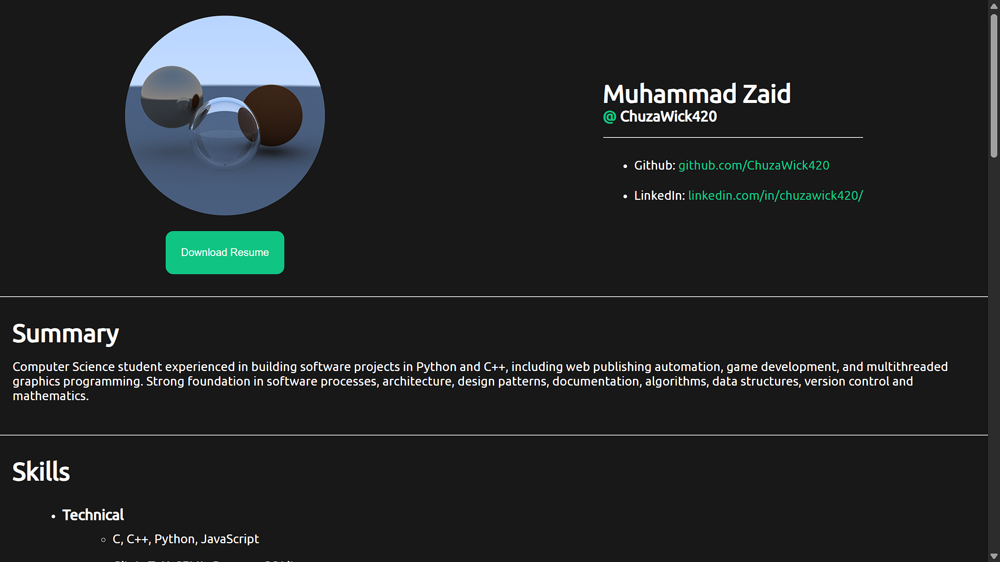
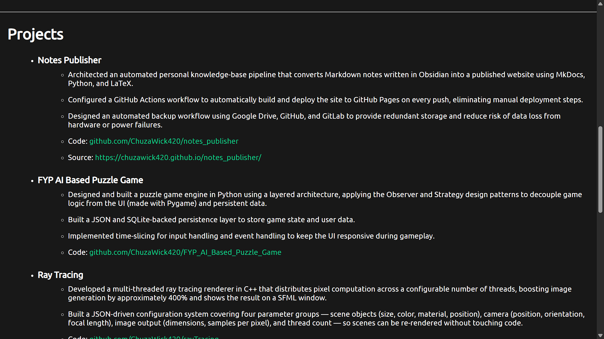

# Version History
## Version 1.x.x
I had developed the [first iteration](https://github.com/ChuzaWick420/Portfolio/releases/tag/v1.0.0) myself but soon I realized, it's just a resume but as a website. I needed something with visuals for it to be attractive.

## Version 2.x.x
I was dealing with a lot of projects at the time and I needed a portfolio quickly up and running too. So for the time being, I decided to use a template instead and found a good looking[^1] one.

# Acknowledgement
[^1]: I used [Jacobo Martínez's portfolio template](https://github.com/cobiwave/simplefolio) for the versions 2.0.0+.
